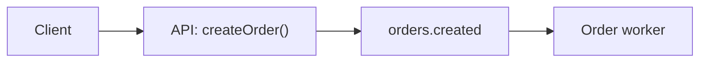

# Mermaid rules (validated)

Tooling and core limits below are **verified/OFFICIAL**; node-count *targets* are
reasoned ([SYNTHESIS]). Never commit a diagram that has not passed `maid`.

## Validate every diagram

`maid` (`@probelabs/maid`) is a browserless Mermaid validator. It **actively
validates** these five types — and only these:

- `flowchart` / `graph`
- `sequenceDiagram`
- `classDiagram`
- `stateDiagram-v2`
- `pie`

Other diagram types **pass through unvalidated** — avoid them in committed docs
unless render-tested. Render guarantee: when `maid` says a diagram of the five
validated types is valid, it will render.

```bash
npx -y @probelabs/maid docs/                 # validate every diagram in a dir
npx -y @probelabs/maid README.md             # validate fenced mermaid in a file
npx -y @probelabs/maid diagram.mmd --fix     # safe auto-fixes (-> to -->, quote labels…)
npx -y @probelabs/maid docs/ --format json   # machine-readable (for the gate)
npx -y @probelabs/maid diagram.mmd --strict  # require quoted labels
```

The plugin wraps this as `scripts/validate_mermaid.sh` (exit 1 on error; warnings
do not fail).

## Syntax pitfalls (the common AI failure modes)

- **Arrows:** `-->` in flowcharts; `->>` / `-->>` in sequence. **Never `->` in a
  flowchart** — `maid` flags it; `--fix` rewrites it.
- **Quote labels containing** `()[]{}:;,"#` — `A["process(payment)"]`. The single
  most common AI mistake. (Or HTML entities, e.g. `#` → `#35;`.)
- **The word `end` breaks flowcharts** unless capitalized (`End` / `END`).
- **A leading `o` or `x` on an edge** makes an unintended circle/cross edge
  (`A---oB`); add a space or capitalize (`A--- oB`, `A---OB`).
- Valid flowchart directions: `TD` / `TB` / `BT` / `LR` / `RL`. Always start with a
  diagram header.

## Rendering constraints

- **GitHub:** renders ` ```mermaid ` fenced blocks in Issues/Discussions/PRs/wikis/
  Markdown. **`click` directives and interactive links are blocked by GitHub's CSP**
  (diagrams render in a sandboxed `viewscreen.githubusercontent.com` iframe);
  relative links break. **No clickable nodes in committed diagrams** — put links in
  prose instead. (markdownlint and `maid` will NOT catch this; check it by hand.)
- **GitLab:** self-managed GitLab with a `Cross-Origin-Resource-Policy` header of
  `same-site`/`same-origin` makes Mermaid silently fail → use `cross-origin`.
- **Mermaid core:** `maxTextSize` default **50000** (source beyond it fails);
  `securityLevel` default `strict` (HTML in labels encoded, `click` disabled).

## Size

Labels ≤ ~40 chars; **diagram ≤ ~15–20 nodes**. Beyond that, split per subsystem or
flow. A diagram that needs scrolling is a smell.

## Good vs risky

````text
GOOD (renders):


RISKY (silently fails on GitHub):
```mermaid
graph LR
  A(create order(v2)) -> B[save]   %% unquoted parens; '->' not '-->'
  click A "https://x" _blank        %% click blocked by GitHub CSP
```
````
